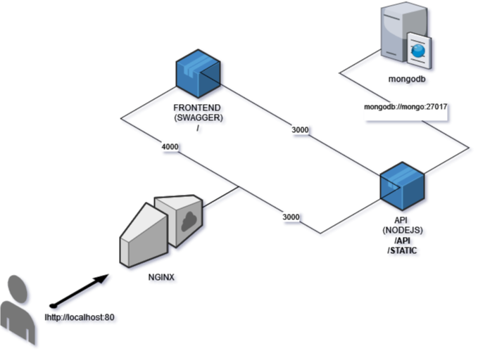

# Pokemon API

###

    {
        author: Guilherme Maron
    ,   email:  guilherme.maron@zoolengineering.se
    }

An API to work with Pokemon data

# How to get the code

### `git clone https://github.com/GuiMaron/pokemon_api.git`

Go into the cloned directory `pokemon_api`

# How to run with Docker ([http://docker.com](docker.com))

**Development environment**

### `docker-compose -f docker-compose-dev.yml up`

And access it in the browser, you will get to a Swagger page

### [http://localhost](http://localhost)

To restart it

### `docker-compose -f docker-compose-dev.yml down && docker-compose -f docker-compose-dev.yml up --build`

Usefull script (to reset database to the original state), from the `\api` folder
### `npm run reset-db`

But before you will need to install the dependencies with
### `npm install --package-lock`

# Architecture

A simple architecture, with a client-facing NGINX
We have 3 important services, the `frontend` running a `Swagger` and the `api` running a NodeJS application
To Database used was `MongoDB`

# Time

I spent around 10-12 hours in this project

In the 5 hours span I was able to fetch pokemon, validate some endpoints and create the base of everything: `RequestHandler`, `validator`, several `Joi.schemas`

# Struggles

I had some problems with the `default.conf(.dev)` NGINX configuration files. Also with the Swagger configuration. So I still have a
warning and workaround around the POST endpoint in the `Swagger`

# If I had more time?

Well, if I had even more time I would improve this points first

- implement the Pokemon Suggestion endpoint
- writing tests, I already set up the tests container, but scrapped it midway
- improve logging
- improve returning error codes: `201`, `404`
